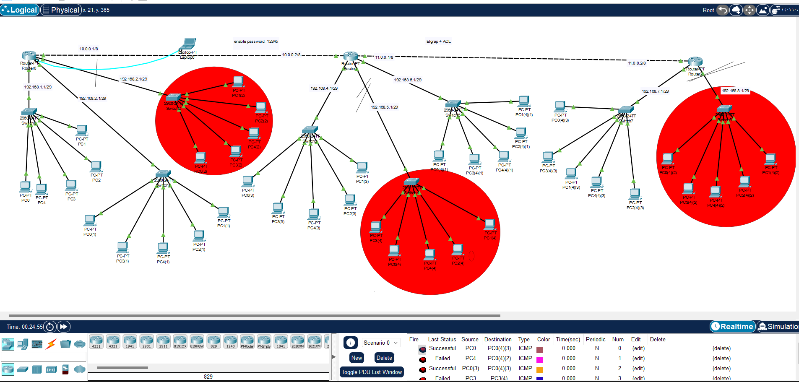

# مشروع: EIGRP + Standard ACL Point-to-Point Network
<div>

</div>
## 🔹 الهدف من المشروع
تصميم شبكة تعتمد على **EIGRP** للتوجيه الديناميكي مع تطبيق **Standard ACL** للتحكم في الوصول لبعض الشبكات.

- تطبيق **قوائم التحكم في الوصول (ACL)** للتحكم في الاتصال بين بعض الشبكات ومنع الوصول إلى أجزاء محددة من الشبكة.
- 
- استخدام هيكلية **Point-to-Point** لربط الراوترات بشكل مباشر لزيادة الكفاءة والأمان.
- تحسين إدارة الشبكة وتوزيع الموارد باستخدام **EIGRP** كبروتوكول توجيه ديناميكي.
- 

## 🔹 مكونات المشروع (Project Components)

| العنصر                          | العدد |
|--------------------------------|-------|
| أجهزة التوجيه (Routers)        | 3     |
| الشبكات الفرعية (Subnets)      | 10    |
| أجهزة الحاسب في كل شبكة فرعية  | 5     |


## 🔹 تفاصيل الشبكات

| الشبكة | الأجهزة | العنوان (IP) | Subnet Mask | ملاحظات |
|--------|----------|--------------|-------------|----------|
| ربط Router1 ↔ Router2 | - | 10.0.0.1 / 10.0.0.2 | 255.0.0.0 | Backbone |
| شبكة 2 | 5 أجهزة | 192.168.1.0 | 255.255.255.248 | - |
| شبكة 3 | 5 أجهزة | 192.168.2.0 | 255.255.255.248 | **ACL Blocked** |
| شبكة 4 | 5 أجهزة | 192.168.3.0 | 255.255.255.248 | - |
| شبكة 5 | 5 أجهزة | 192.168.4.0 | 255.255.255.248 | - |
| شبكة 6 | 5 أجهزة | 192.168.5.0 | 255.255.255.248 | **ACL Blocked** |
| شبكة 7 | 5 أجهزة | 192.168.6.0 | 255.255.255.248 | - |
| ربط Router2 ↔ Router3 | - | 11.0.0.1 / 11.0.0.2 | 255.0.0.0 | Backbone |
| شبكة 9 | 5 أجهزة | 192.168.7.0 | 255.255.255.248 |

---

## 🔹 أوامر الاختبار
```bash
ping [IP]           # لاختبار الاتصال
show ip route       # لعرض جدول التوجيه
show access-lists   # لعرض ACL


> 🔑 **ملاحظة**  
> كلمة المرور للدخول على **Console** في جميع أجهزة التوجيه:  
> `12345`  
>
> ✅ تم رفع المشروع كامل في المستودع.Elgrap.pkt
